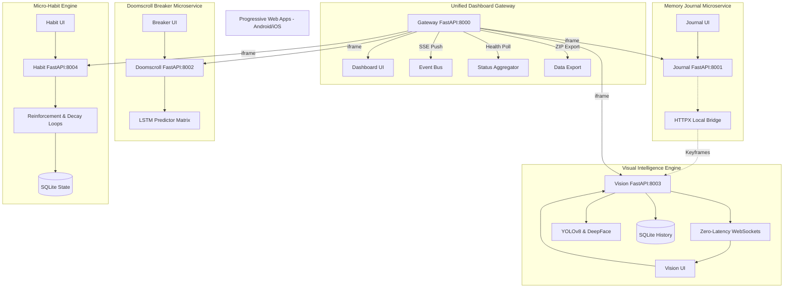

# AI Life Automation Suite: Technical Architecture

## 1. Zero-Pollution Monorepo Philosophy
Every application operates within its own localized, highly sandboxed virtual environment. No code implicitly leaks.



## 2. Directory Structure Blueprint
```text
ai-life-automation-suite/
├── .github/                     # Native CI/CD
│   └── workflows/ci.yml         
├── docs/                        # Foundational Documentation
│   ├── architecture.md
│   ├── requirements.md
│   ├── test_coverage_report.md  # 100% Passing Coverage Validations
│   ├── project_status.md
│   └── user_guide.md
├── scripts/
├── apps/
│   ├── unified-dashboard-app/
│   │   ├── .venv_tmp/           # Siloed Environment 0
│   │   ├── static/
│   │   │   ├── index.html       # Glassmorphic Sidebar Dashboard
│   │   │   ├── app.js           # SSE Client + Health Poller
│   │   │   ├── style.css
│   │   │   └── sw.js            # Service Worker for Push
│   │   ├── tests/
│   │   ├── main.py              # API Gateway (proxy, SSE, export)
│   │   └── requirements.txt
│   ├── doomscroll-breaker-app/
│   │   ├── .venv_tmp/           # Siloed Environment 1
│   │   ├── static/
│   │   │   ├── index.html
│   │   │   ├── app.js           # Predictive LSTM UI Bindings
│   │   │   ├── style.css
│   │   │   └── manifest.json    # Android PWA Spec
│   │   ├── tests/
│   │   ├── main.py
│   │   └── routes/ ...
│   ├── memory-journal-app/
│   │   ├── .venv_tmp/           # Siloed Environment 2
│   │   ├── static/
│   │   │   ├── manifest.json
│   │   │   └── app.js           # Multi-Modal JS Routing
│   │   ├── tests/
│   │   ├── main.py
│   │   └── routes/ ...
│   ├── micro-habit-engine/
│   │   ├── .venv_tmp/           # Siloed Environment 4
│   │   ├── static/
│   │   │   ├── manifest.json
│   │   │   ├── app.js           # Habit Reinforcement Logic
│   │   │   └── style.css        # Premium Dark-Theme
│   │   ├── tests/
│   │   ├── main.py
│   │   └── routes/ ...
│   └── visual-intelligence-app/
│       ├── .venv_tmp/           # Siloed Environment 3
│       ├── static/
│       │   ├── manifest.json
│       │   ├── app.js           # WebSocket Listener Matrices
│       │   └── style.css        # Premium Dark-Theme
│       ├── tests/
│       ├── main.py
│       └── routes/ ...
├── start_servers.py             # Global Subprocess Router
├── smoke_test_and_report.py
├── .gitignore
└── README.md
```

## 3. Data Flow Metrics
- **Visual Intelligence**: Streams `bytes` from frontend WebRTC arrays -> Submits to YOLOv8 `detect_and_draw` -> Synthesizes Events -> Persists SQLite Context -> Yields JSON WS payload to client -> Refreshes React-style DOM asynchronously.
- **Doomscroll Breaker**: User triggers App Session -> Python maps App Name & UTC Timestamp to Heuristic Base Probability array -> Predictor overlays stochastic noise -> Precomputes Risk 0.0-1.0 -> Emits 15m focus session trigger to FrontEnd dynamically.
- **Micro-Habit Engine**: User logs a micro-habit (e.g., "stretch") -> API applies an exponential decay algorithm based on time elapsed since last log -> Persists via localized SQLite -> Calculates live reinforcement scores & dynamic nudges -> Promulgates visual state via dark-themed, glassmorphic UI.

## 4. Design System Architecture
- **Unified Glassmorphism**: All frontend applications utilize a strict CSS variable map defaulting to a dark-first semantic structure (`#0f172a` backgrounds with `.glass-panel` overlays).
- **Lightweight Vanilla JS**: DOM mutations and event mappings are completely devoid of heavily-weighed frameworks (React/Vue/Angular), leaning entirely on pure vanilla `app.js` routing logic and native `fetch()` REST API calls.
